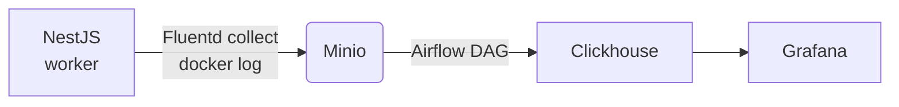

End-to-end log processing pipeline using Minio-Airflow-Clickhouse
=================================================================

personal experiment with Apache Airflow. based on:
- [Running Airflow in Docker](https://airflow.apache.org/docs/apache-airflow/stable/howto/docker-compose/index.html)

## Overview



This is my experiment on implementing end-to-end log processing pipeline. Outline of the pipeline:
- the log is generated by services and sent via stdout to be collected by docker
- the log collected by docker would be further sent into Minio object storage with the help of fluentd
- periodically, and Airflow DAG would push the logs in minio into Clickhouse

## Key Technologies
- docker compose : orchestration
- [NestJs](https://nestjs.com) : web service
- [FluentBit](https://fluentbit.io) : log file collector
- [Minio](https://min.io) : object storage for collection log files
- [Apache Airflow](https://airflow.apache.org) : data processing pipeline
- [Clickhouse](https://clickhouse.com) : final analytic database / data warehouse
- [Grafana](https://grafana.com) : Visualization

## Install
1. clone repo
2. copy `.env.example` to `.env`
3. setup airflow user:
  ```bash
  echo -e "AIRFLOW_UID=$(id -u)" >> .env
  ```
4. docker compose up -d

## Using this repo
### Minio
check localhost:9001 . the default user & password is 'minio-root'

### Grafana
check localhost:3002

### Clickhouse
the default username is 'default' with password 'clickhouse-root'

### Generating load
Use docker compose exec to run wrk with the provided script

```bash
docker compose exec tester wrk -c 100 \
                               -t 5 \
                               --timeout 1s \
                               --latency \
                               -d "30s" \
                               -s ./script.lua \
                               http://nestjs:3000/dummy
```

## Pipeline Explanation
### FluentBit
This acts as log collector, tail-ing all docker logs in the host, adding several metadata like
container id & name, and forwarding it to Minio

### Minio
Act as a "data lake". By introducing Minio as log storage instead of directly piping the log into
clickhouse, we gain several advantages:
- allow excess load handling incase there are peak traffic
- act as backup and allow better data retention policy

### Clickhouse
Our main analytical engine and "data warehouse". Clickhouse is a very powerful OLAP database with
lots of features & integrations

### Grafana
Our visualization tool. We use this to access Clickhouse and provide basic dashboard


