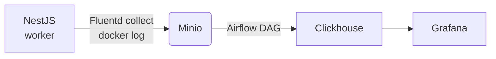

FAMiC Stack
===========

Let’s be real—tools like NewRelic and Datadog are powerful, but they’re closed-source and insanely expensive. On the other hand, stacks like ELK and LGTM are great because they’re open-source, but at the end of the day, they’re just storing logs—not giving you the deep analysis you actually need. Logs aren’t just something to search; they’re data that needs to be correlated, processed, and analyzed properly.  

That’s why I built **FAMiC**—an open-source monitoring stack with real analytics power.  

- **[FluentBit](https://fluentbit.io)** – Blazing-fast, flexible log collection.  
- **[Airflow](https://airflow.apache.org)** – A powerful data pipeline that actually processes logs, not just stores them. 
- **[Minio](https://min.io)** – Scalable, reliable storage that won’t break the bank.   
- **[Clickhouse](https://clickhouse.com)** – A true OLAP database, built for deep analysis at lightning speed.  

With FAMiC, you get full control, real insights, and a system that scales effortlessly—without the ridiculous price tag.

## Features
- **Scalable Log Collection:** Gather Docker logs using FluentBit.
- **Resilient Storage:** Use Minio as a temporary log storage ("data lake") to handle peak traffic and ensure data retention.
- **Automated Processing:** Schedule and track log imports with Apache Airflow.
- **Efficient Analytics:** Leverage ClickHouse’s OLAP capabilities for fast data processing.
- **Real-Time Visualization:** Explore and analyze log data with Grafana dashboards.
- **Modular Architecture:** Clean separation of concerns for easier maintenance and future enhancements.

## Other software I used in this example
- [Docker Compose](https://docs.docker.com/compose) : orchestration. easiest way to orchestrate multiple services for local server. maybe I'll make another example with k8s some other time.
- [NestJs](https://nestjs.com) : example web service. obviously you could use whatever programming language & framework you fancy. just make sure log into stdout so it could be catched properly by the FAMiC stack
- [Grafana](https://grafana.com) : Visualization. you could also use more data-analysis tools like Metabase or Superset. But Grafana is more popular for web developers
- [Wrk](https://github.com/wg/wrk) : Load testing tool

## Pipeline Overview



This project implements a complete log processing pipeline where logs are:

1. Generated by services and captured via Docker’s stdout.
2. Collected by FluentBit and stored in Minio.
3. Periodically processed by Apache Airflow, which imports logs into ClickHouse.
4. Visualized using Grafana.

This modular approach ensures scalability, efficient processing, and real-time analytics.

## Install
1. clone repo
2. copy `.env.example` to `.env`
3. setup airflow user:
  ```bash
  echo -e "AIRFLOW_UID=$(id -u)" >> .env
  ```
4. docker compose up -d

## Usage
### Minio

- Access URL: http://localhost:9001
- Default Credentials:
  - Username: minio-root
  - Password: minio-root

### Airflow

- Access URL: http://localhost:8080
- Default Credentials:
  - Username: airflow
  - Password: airflow

To use Airflow’s CLI tools, execute commands like:

```bash
docker compose exec airflow-scheduler airflow dags list
docker compose exec airflow-scheduler airflow dags list-import-errors
docker compose exec airflow-scheduler airflow tasks list import_minio_to_clickhouse
```

### ClickHouse

- Default Credentials:
  - Username: default
  - Password: clickhouse-root

### Grafana

- Access URL: http://localhost:3002
- credentials has been disabled so you could use Grafana immediately
- In this repo we have setup clickhouse plugin so our Grafana instance is ready to connect with our clickhouse
server. Just add a new connection in "Home > Connections > Data sources > Add data source". Search
for "clickhouse" and use this settings:
    - server address: clickhouse
    - port: 9000
    - protocol: native
    - username: default
    - password: clickhouse-root

    Click "save & test" to make sure our inputs are correct. If you see a notification that data source is working, you could head to "Home > Explore".

### Load/Performance testing

Simulate load using the provided wrk script:

```bash
docker compose exec tester wrk -c 100 \
                               -t 5 \
                               --timeout 1s \
                               --latency \
                               -d "30s" \
                               -s ./script.lua \
                               http://nestjs:3000/dummy
```

## Pipeline Explanation
### FluentBit
Serves as a log collector, tail-ing all docker logs in the host, adding several metadata like
container id & name, and forwarding it to Minio. If you have played with FluentBit before, you may
realize that FluentBit is pretty powerful. Its even possible to directly pipe all docker logs into
clickhouse without needing any intermediary steps like Minio & Airflow. However in the next
section I will explain some advantages we try to gains by using the longer method.

On the other hand, I faced some challenges when formatting & parsing the docker log files. Because
we only used the docker log files, we dont get many docker related by default (including container
name). To solve that, we use some lua script to parse container_id from the FluentBit tag, and
retrieve container config file in docker folder to finally obtain container name.

<p align="center">
  
  Screenshot of FluentBit log parsing results
</p>

### Minio
Act as a "data lake". By introducing Minio as log storage instead of directly piping the log into
clickhouse, we gain several advantages:
- allow excess load handling incase there are peak traffic
- act as backup and allow better data retention policy

In production we may replace Minio with cloud offerings such as Amazon's S3 or Cloudflare's R2.
But for our project here, using Minio is sufficient.

The issue that I just found out about Minio, which actually just tried to match with S3's API
spec, is regarding sorting the filename. S3 actually dont provide any way to sort the files based
on time. To handle this, I decided to add timestamp into our filename so we would be able to sort
the file.

<p align="center">
  
  Screenshot of collected docker log files in our Minio instance
</p>

### Airflow
here, we build a simple DAG script to periodically check our minio instance, import into
clickhouse, and keep track which log file we already imported. To keep track of the log file, we
create a 'migration' table to store all log files & its import status (new/processing/success/
error).

One interesting thing in our DAG is the actual import from Minio into Clickhouse is not done via
our code. Instead, we tell Clickhouse to fetch the Minio file themselve using their powerful [S3
integration feature](https://clickhouse.com/docs/en/integrations/s3#reading-data-from-s3). This
not only make our code much more simple, its also makes the process way more efficient as we avoid
processing the data in our Airflow DAG and instead let Clickhouse process it themselves.

For the folder structure, at first I decided to experimenting with plain python to make sure the
logic and package dependency already to my liking. I put the code into `./airflow/dags/common`
folder to separate it with the actual DAG files. after the code is ready, I just need to create
the DAG file and import the actual code. This approach somewhat resembles the popular "clean code"
approach. the code is divided into the DAG file (which correspondence with controller & service
in clean code) approach, and the "repository" which deals with interacting with third party
dependency (in this case Clickhouse & Minio)

<p align="center">
  
  Screenshot of our Airflow DAG monitoring dashboard
</p>

### Clickhouse
Our main analytical engine and "data warehouse". Clickhouse is a very powerful OLAP database with
lots of features & integrations. You could use regular SQL instead of learning yet another niche
query language. Its also very fast, you could just do your analytics in real-time. The scalability
is also top notch. Its distributed architecture allows you to do horizontal scaling painlessly.

### Grafana
Our visualization tool. We use this to access Clickhouse and provide basic dashboard.

<p align="center">
  
  Screenshot of Grafana log display interface
</p>

## License

The MIT License (MIT)

Copyright © 2025 <Abdurrahman Shofy Adianto>

Permission is hereby granted, free of charge, to any person obtaining a copy of this software and associated documentation files (the “Software”), to deal in the Software without restriction, including without limitation the rights to use, copy, modify, merge, publish, distribute, sublicense, and/or sell copies of the Software, and to permit persons to whom the Software is furnished to do so, subject to the following conditions:

The above copyright notice and this permission notice shall be included in all copies or substantial portions of the Software.

THE SOFTWARE IS PROVIDED “AS IS”, WITHOUT WARRANTY OF ANY KIND, EXPRESS OR IMPLIED, INCLUDING BUT NOT LIMITED TO THE WARRANTIES OF MERCHANTABILITY, FITNESS FOR A PARTICULAR PURPOSE AND NONINFRINGEMENT. IN NO EVENT SHALL THE AUTHORS OR COPYRIGHT HOLDERS BE LIABLE FOR ANY CLAIM, DAMAGES OR OTHER LIABILITY, WHETHER IN AN ACTION OF CONTRACT, TORT OR OTHERWISE, ARISING FROM, OUT OF OR IN CONNECTION WITH THE SOFTWARE OR THE USE OR OTHER DEALINGS IN THE SOFTWARE.
