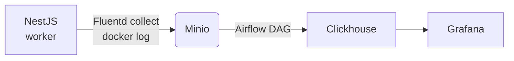

End-to-end log processing pipeline using Minio-Airflow-Clickhouse
=================================================================

personal experiment with Apache Airflow. based on:
- [Running Airflow in Docker](https://airflow.apache.org/docs/apache-airflow/stable/howto/docker-compose/index.html)

## Overview



This is my experiment on implementing end-to-end log processing pipeline. Outline of the pipeline:
- the log is generated by services and sent via stdout to be collected by docker
- the log collected by docker would be further sent into Minio object storage with the help of fluentd
- periodically, and Airflow DAG would push the logs in minio into Clickhouse

## Key Technologies
- docker compose : orchestration
- [NestJs](https://nestjs.com) : web service
- [FluentBit](https://fluentbit.io) : log file collector
- [Minio](https://min.io) : object storage for collection log files
- [Apache Airflow](https://airflow.apache.org) : data processing pipeline
- [Clickhouse](https://clickhouse.com) : final analytic database / data warehouse
- [Grafana](https://grafana.com) : Visualization

## Install
1. clone repo
2. copy `.env.example` to `.env`
3. setup airflow user:
  ```bash
  echo -e "AIRFLOW_UID=$(id -u)" >> .env
  ```
4. docker compose up -d

## Using this repo
### Minio
check localhost:9001 . the default user & password is 'minio-root'

### Airflow
availabel on localhost:8080 . the default username & password is 'airflow'

airflow also provided CLI tools to execute some common administrative task. IMHO the best way to
run it is to use `docker compose exec airflow-scheduler`. example:

```bash
$ docker compose exec airflow-scheduler airflow dags list
$ docker compose exec airflow-scheduler airflow dags list-import-errors
$ docker compose exec airflow-scheduler airflow tasks list import_minio_to_clickhouse
```

### Clickhouse
the default username is 'default' with password 'clickhouse-root'

### Grafana
check localhost:3002

### Generating load
Use docker compose exec to run wrk with the provided script

```bash
docker compose exec tester wrk -c 100 \
                               -t 5 \
                               --timeout 1s \
                               --latency \
                               -d "30s" \
                               -s ./script.lua \
                               http://nestjs:3000/dummy
```

## Pipeline Explanation
### FluentBit
This acts as log collector, tail-ing all docker logs in the host, adding several metadata like
container id & name, and forwarding it to Minio. If you have played with FluentBit before, you may
realize that FluentBit is pretty powerful. Its even possible to directly pipe all docker logs into
clickhouse without needing any intermediary steps like Minio & Airflow. However in the next
section I will explain some advantages we try to gains by using the longer method.

On the other hand, I faced some challenges when formatting & parsing the docker log files. Because
we only used the docker log files, we dont get many docker related by default (including container
name). To solve that, we use some lua script to parse container_id from the FluentBit tag, and
retrieve container config file in docker folder to finally obtain container name.

<p align="center">
  
  Screenshot of FluentBit log parsing results
</p>

### Minio
Act as a "data lake". By introducing Minio as log storage instead of directly piping the log into
clickhouse, we gain several advantages:
- allow excess load handling incase there are peak traffic
- act as backup and allow better data retention policy

In production we may replace Minio with cloud offerings such as Amazon's S3 or Cloudflare's R2.
But for our project here, using Minio is sufficient.

The issue that I just found out about Minio, which actually just tried to match with S3's API
spec, is regarding sorting the filename. S3 actually dont provide any way to sort the files based
on time. To handle this, I decided to add timestamp into our filename so we would be able to sort
the file.

<p align="center">
  
  Screenshot of collected docker log files in our Minio instance
</p>

### Airflow
here, we build a simple DAG script to periodically check our minio instance, import into
clickhouse, and keep track which log file we already imported. To keep track of the log file, we
create a 'migration' table to store all log files & its import status (new/processing/success/
error).

One interesting thing in our DAG is the actual import from Minio into Clickhouse is not done via
our code. Instead, we tell Clickhouse to fetch the Minio file themselve using their powerful [S3
integration feature](https://clickhouse.com/docs/en/integrations/s3#reading-data-from-s3). This
not only make our code much more simple, its also makes the process way more efficient as we avoid
processing the data in our Airflow DAG and instead let Clickhouse process it themselves.

For the folder structure, at first I decided to experimenting with plain python to make sure the
logic and package dependency already to my liking. I put the code into `./airflow/dags/common`
folder to separate it with the actual DAG files. after the code is ready, I just need to create
the DAG file and import the actual code. This approach somewhat resembles the popular "clean code"
approach. the code is divided into the DAG file (which correspondence with controller & service
in clean code) approach, and the "repository" which deals with interacting with third party
dependency (in this case Clickhouse & Minio)

<p align="center">
  
  Screenshot of our Airflow DAG monitoring dashboard
</p>

### Clickhouse
Our main analytical engine and "data warehouse". Clickhouse is a very powerful OLAP database with
lots of features & integrations

### Grafana
Our visualization tool. We use this to access Clickhouse and provide basic dashboard. In this repo
we have setup clickhouse plugin so our Grafana instance is ready to connect with our clickhouse
server. Just add a new connection in "Home > Connections > Data sources > Add data source". Search
for "clickhouse" and use this settings:
- server address: clickhouse
- port: 9000
- protocol: native
- username: default
- password: clickhouse-root

Click "save & test" to make sure our inputs are correct. If you notification that data source is
working, you could head to "Home > Explore".

<p align="center">
  
  Screenshot of Grafana log display interface
</p>

## Performance Analysis
TBD
