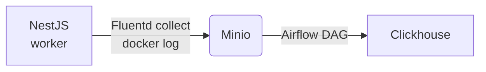

End-to-end log processing pipeline using Minio-Airflow-Clickhouse
=================================================================

personal experiment with Apache Airflow. based on:
- [Running Airflow in Docker](https://airflow.apache.org/docs/apache-airflow/stable/howto/docker-compose/index.html)

## Overview



This is my experiment on implementing end-to-end log processing pipeline. Outline of the pipeline:
- the log is generated by services and sent via stdout to be collected by docker
- the log collected by docker would be further sent into Minio object storage with the help of fluentd
- periodically, and Airflow DAG would push the logs in minio into Clickhouse

## Key Technologies
- docker compose : orchestration
- NestJs : web service
- Fluentd : log file collector 
- Minior : object storage for collection log files
- Airflow : data processing pipeline
- Clickhouse : final analytic database / data warehouse

## Install
1. clone repo
2. setup airflow user:
  ```bash
  echo -e "AIRFLOW_UID=$(id -u)" > .env
  ```
3. docker compose up -d
